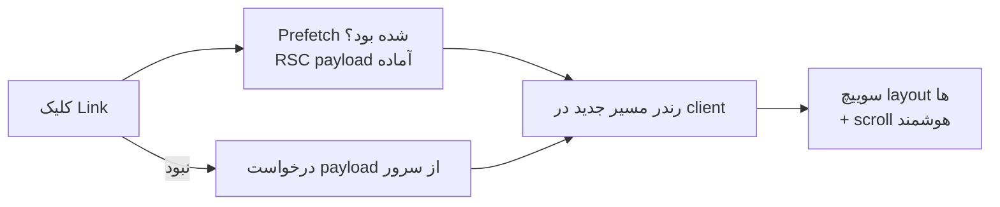

# فصل ۵ — Next.js: ساختار پروژه و Routing

> 📖 **منبع رسمی:** [nextjs.org/docs/app](https://nextjs.org/docs/app) — Project Structure، Layouts and Pages، Linking and Navigating
> 🎯 **هدف:** قرارداد فایل‌محور App Router — layout/page/loading/error/not-found/route + ناوبری Link — با نکات پشت‌صحنه‌ای که در مصاحبه می‌پرسند.

---

## ۵.۱ — Routing = پوشه‌بندی

App Router یعنی «پوشه = مسیر URL». قراردادهای فایل ویژه (special files):

| فایل | نقش |
|---|---|
| `page.tsx` | **محتوای عمومی مسیر** — بدون آن مسیر قابل دسترسی نیست! |
| `layout.tsx` | قاب مشترک مسیر و فرزندانش (nav، sidebar) — state حفظ می‌شود |
| `loading.tsx` | fallback حین رندر = Suspense خودکار |
| `error.tsx` | مرز خطا (باید `"use client"` باشد) |
| `not-found.tsx` | صفحه 404 برای `notFound()` این بخش |
| `route.ts` | Route Handler — API endpoint (این پوشه page نمی‌گیرد) |
| `template.tsx` | مثل layout ولی در هر ناوبری **remount** می‌شود (انیمیشن‌ها) |
| `default.tsx` | fallback برای slot های ناتمام در parallel routes |

ساختار نمونه:

```
app/
├── layout.tsx          ← ریشه (html/body اینجاست)
├── page.tsx            ← /
├── blog/
│   ├── page.tsx        ← /blog
│   └── [slug]/
│       └── page.tsx    ← /blog/:slug
├── dashboard/
│   ├── layout.tsx      ← قاب داشبورد
│   ├── settings/page.tsx
│   └── loading.tsx     ← فقط زیر داشبورد!
└── api/
    └── products/route.ts   ← /api/products
```

## ۵.۲ — Layoutها: نکاتی که وسط کار یادت می‌رود

```tsx
// app/layout.tsx — فقط layout ریشه می‌تواند <html> و <body> داشته باشد
export default function RootLayout({ children }: { children: React.ReactNode }) {
  return (
    <html lang="fa" dir="rtl">
      <body>{children}</body>
    </html>
  );
}
```

- layout ها **دوباره رندر نمی‌شوند** هنگام ناوبری داخل‌شان — state و scroll حفظ است (برخلاف template)
- layout می‌تواند async باشد و دیتا بگیرد (Server Component است)
- به محتوای فرزندان دسترسی مستقیم ندارد و فقط `children` می‌گیرد؛ به مسیر فعلی هم دسترسی ندارد (اگر لازم شد: کامپوننت Client با `usePathname` یا middleware)

### Route Groups و پوشه‌های بدون URL

- `(marketing)/about/page.tsx` → مسیر `/about` — پرانتز یعنی «فقط برای سازمان‌دهی، در URL نمی‌آید» (دو layout موازی بدون تغییر مسیر)
- `_components/` → آندرلاین اول = «private» — از routing مستثنی

### Dynamic segments

```tsx
// app/blog/[slug]/page.tsx
export default async function Page({ params }: { params: Promise<{ slug: string }> }) {
  const { slug } = await params;              // ⚠️ در Next 15+ params یک Promise است!
}

// [...slug] catch-all — /a/b/c را هم می‌گیرد
// [[...slug]] optional catch-all — / را هم می‌گیرد
```

## ۵.۳ — ناوبری: Link (نه <a>!)

```tsx
import Link from "next/link";

<Link href="/blog/42" prefetch>پست ۴۲</Link>
<Link href={`/blog?tag=${tag}`} scroll={false} replace>...</Link>
```

چرا Link به جای `<a>`:
1. **Client-side navigation** — بدون reload کامل صفحه
2. **Prefetch خودکار** — وقتی لینک وارد viewport می‌شود، مسیر پیش‌بارگذاری می‌شود (در production) → ناوبری حس فوری می‌دهد
3. نگه‌داشتن state layout ها و scroll هوشمند

پرچم‌ها: `prefetch={false}` برای لینک‌های خارجی یا کم‌اهمیت؛ `replace` به جای push در history؛ `scroll={false}` برای حفظ اسکرول.

نکته: **useRouter** برای ناوبری برنامه‌ای:

```tsx
"use client";
import { useRouter, usePathname, useSearchParams } from "next/navigation";
const router = useRouter();
router.push("/dashboard");     // router.replace / back / refresh
const pathname = usePathname(); // مسیر فعلی (برای هایلایت منو)
const searchParams = useSearchParams(); // ⚠️ یک hook است — کامپوننت client یا Suspense boundary لازم دارد
```

## ۵.۴ — ناوبری چطور کار می‌کند (پشت صحنه)



ناوبری در App Router یعنی جابجایی **RSC payload** (نه HTML کامل) — به همین دلیل layout های مشترک لمس نمی‌شوند.

---

## ✅ جمع‌بندی فصل

- پوشه = مسیر؛ فایل‌های ویژه نقش‌ها را می‌دهند؛ **بدون page.tsx مسیری نیست**
- layout: قاب با state پایدار؛ فقط ریشه html/body دارد؛ async مجاز
- `(group)` سازمان‌دهی بدون URL؛ `_folder` خصوصی؛ `[param]` و catch-all
- **params/searchParams یک Promise اند** — await کن (Next 15+)
- Link = ناوبری client + prefetch؛ router.push برای برنامه‌ای

## 📝 تمرین فصل ۵

1. ساختار مسیرهای زیر را طراحی کن (پوشه‌ها): `/dashboard/overview`، `/dashboard/settings/profile` با یک قاب مشترک داشبورد و loading مخصوص فقط برای settings.
2. چرا این ارور می‌گیری؟ `app/about/layout.tsx` شامل `<html>` است — چه بلایی سر سایت می‌آید؟
3. اگر `app/blog/page.tsx` و `app/blog/route.ts` را هم‌زمان داشته باشی چه می‌شود؟
4. چرا هایلایتِ لینک فعال را با `usePathname` و در کامپوننتی با `"use client"` می‌سازند؟ layout به تنهایی چرا از پسش برنمی‌آید؟
5. فرق `router.push` و `router.replace` را در یک سناریوی واقعی (لاگین!) بگو.

<details><summary>جواب‌ها</summary>

```text
app/dashboard/layout.tsx        ← قاب مشترک
app/dashboard/overview/page.tsx
app/dashboard/settings/
├── loading.tsx                 ← فقط شاخه settings
└── profile/page.tsx
```
2. فقط layout ریشه مجاز به html/body است؛ تودرتویی دو تگ html ایجاد می‌کند (یا ارور می‌دهد) — layout داخلی فقط قاب محتوا است.
3. تعارض! یک مسیر نمی‌تواند هم page و هم route داشته باشد — build ارور می‌دهد. API را در `app/api/blog/route.ts` بگذار.
4. layout سرور است و به مسیر فعلی دسترسی ندارد (children می‌گیرد)؛ pathname فقط سمت کلاینت با usePathname در دسترس است.
5. بعد از لاگین نباید بتوان با back به صفحه‌ی لاگین برگشت (back یعنی خروج!) — `router.replace("/dashboard")`.
</details>

➡️ **فصل بعد:** ⭐ مهم‌ترین فصل — Server vs Client Components.
