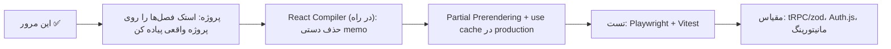

# فصل ۱۲ — چیت‌شیت دوتایی، گلاساری و ۲۰ سوال مصاحبه

> 🎯 **هدف:** فشرده‌ترین مرجع ممکن — React در یک صفحه، Next.js در یک صفحه، و سوالاتی که در مصاحبه‌های Next.js واقعاً پرسیده می‌شوند.

---

## ۱۲.۱ — چیت‌شیت React 19

```tsx
// ═══ State ═══
const [count, setCount] = useState(0);
setCount((c) => c + 1);                    // آپدیت وابسته → فرم تابعی
setUser({ ...user, name: "Ali" });         // immutable همیشه
const [state, dispatch] = useReducer(reducer, init);

// ═══ Refs ═══
const ref = useRef<HTMLInputElement>(null);
ref.current?.focus();                      // تغییر = بدون رندر

// ═══ Effects (فقط همگام‌سازی بیرون!) ═══
useEffect(() => {
  const conn = connect(id);
  return () => conn.disconnect();          // cleanup همیشه
}, [id]);                                  // وابستگی‌ها صادقانه

// ═══ Memo (اندازه‌گیری‌شده) ═══
const v = useMemo(() => heavy(a), [a]);
const fn = useCallback(() => {...}, []);

// ═══ Concurrent ═══
const [isPending, start] = useTransition();
start(() => setFilter(q));                 // کم‌اولویت
const deferred = useDeferredValue(value);

// ═══ فرم‌ها (React 19) ═══
const [state, action, pending] = useActionState(fn, init);
const { pending } = useFormStatus();       // داخل <form>
const [opt, addOpt] = useOptimistic(list, (c, x) => [...c, x]);
const data = use(promise);                 // حتی در شرط!

// ═══ قوانین طلایی ═══
// state محاسبه‌شدنی = محاسبه نه state
// props هرگز mutate نشود؛ key = شناسه پایدار
// {0 && <X/>} تله دارد → {n > 0 && ...}
```

## ۱۲.۲ — چیت‌شیت Next.js 16

```tsx
// ═══ فایل‌های قراردادی ═══
page.tsx / layout.tsx / template.tsx
loading.tsx (Suspense خودکار) / error.tsx ("use client")
not-found.tsx / route.ts (API — بدون page)
global-error.tsx (با <html>)

// ═══ پارامترها (Next 15+: Promise!) ═══
const { slug } = await params;                       // [slug]
const { q } = await searchParams;                    // ?q= (dynamic می‌کند)

// ═══ استراتژی رندر ═══
export const revalidate = 60;                        // ISR
export async function generateStaticParams() {...}   // SSG دینامیک
await cookies(); await headers();                    // → SSR dynamic
fetch(url, { next: { revalidate: 60, tags: ["posts"] } });
fetch(url, { cache: "no-store" });

// ═══ Mutations ═══
"use server";
export async function createPost(prev, formData) {
  const parsed = Schema.safeParse(...);
  if (!parsed.success) return { error: "..." };
  await db.create(...);
  revalidateTag("posts");          // یا revalidatePath("/blog")
  redirect("/blog");
}
// فرم: <form action={formAction}> + useActionState + useFormStatus

// ═══ Streaming و ارور ═══
<Suspense fallback={<Skeleton />}><Slow /></Suspense>
notFound();                          // → not-found.tsx
// error.tsx: {error, reset} — reset = تلاش دوباره

// ═══ بهینه‌سازی ═══
<Image src={img} alt="" priority sizes="..." />       // LCP
const f = Vazirmatn({ subsets: ["arabic"], variable: "--f" });
export const metadata / generateMetadata

// ═══ API و میان‌افزار ═══
export async function GET(req: NextRequest) {...}    // route.ts
middleware.ts + config.matcher                       // auth/هدر
// env: بدون پیشوند=سرور؛ NEXT_PUBLIC_= کلاینت (بدون راز!)

// ═══ Server vs Client ═══
// پیش‌فرض سرور؛ "use client" = مرز یک‌طرفه به پایین
// تابع از مرز رد نمی‌شود → Server Action
// Provider کلاینی با children سروری
```

## ۱۲.۳ — گلاساری

| اصطلاح | یعنی |
|---|---|
| RSC (Server Component) | کامپوننت فقط‌سروری — خروجی payload به کلاینت |
| Client Component | SSR اولیه + hydration + تعامل |
| Hydration | زنده‌شدن HTML سرور با JS کلاینت |
| RSC Payload | فرمت داده‌ای خروجی RSC برای ناوبری/استریم |
| SSG / ISR / SSR / CSR | استاتیک در بیلد / استاتیک با بازتولید دوره‌ای / رندر هر درخواست / رندر در مرورگر |
| Server Action | تابع async سروری که از کلاینت قابل صدا زدن است (RPC) |
| Revalidation | ابطال کش — با زمان (ISR)، مسیر یا تگ |
| Request Memoization | یک‌بار fetch برای URL یکسان در یک رندر |
| Streaming | ارسال تدریجی HTML با Suspense |
| Route Handler | endpoint در route.ts |
| Middleware | کد بین‌راهی روی edge، پیش از رسیدن به مسیر |
| Prefetch | پیش‌بارگذاری مسیر بعدی با Link |
| Waterfall | زنجیره await های پشت‌سرهم — دشمن سرعت |
| Prop Drilling | پاس‌دادن props از لایه‌های واسط — علاج: Context یا Composition |

## ۱۲.۴ — ۲۰ سوال مصاحبه (با پاسخ کوتاه)

پاسخ‌ها عمداً یک‌جمله‌ای‌اند؛ برای عمق بیشتر، به فصل مربوط به هر سوال برگرد.

**React (سوالات ۱ تا ۸):**

1. **چرا key لازم است؟** React بین رندرها آیتم‌ها را با key تطبیق می‌دهد تا state و DOM هر آیتم حفظ شود؛ index فقط برای لیست‌های کاملاً ثابت مجاز است.
2. **چرا state یک snapshot است؟** هر رندر، نسخه‌ی ثابتی از مقادیر را می‌بیند؛ آپدیت وابسته به مقدار قبلی را همیشه با فرم تابعی بزن.
3. **چرا آپدیت immutable؟** React تغییر را از روی مرجع تشخیص می‌دهد؛ با mutation، رندر دوباره‌ای رخ نمی‌دهد.
4. **useEffect دقیقاً برای چیست؟** برای همگام‌سازی با سیستم‌های بیرونی — نه جای lifecycle، نه جای محاسبه، نه جای event handler.
5. **cleanup چه زمانی اجرا می‌شود؟** قبل از هر اجرای دوباره‌ی effect و قبل از unmount — کارش قطع همگام‌سازی قبلی است.
6. **useMemo کی لازم می‌شود؟** برای محاسبه‌ی سنگینِ اندازه‌گیری‌شده، یا مرجع پایدار برای وابستگی‌های effect و کامپوننت‌های memo شده.
7. **useTransition چه مشکلی را حل می‌کند؟** آپدیت کند دیگر UI فوری را قفل نمی‌کند، چون رندرش کم‌اولویت و قابل قطع است.
8. **use چه برتری‌ای بر useContext دارد؟** use را می‌توان داخل شرط و حلقه صدا زد و promise هم می‌خواند.

**Next.js (سوالات ۹ تا ۲۰):**

9. **Server Component چیست؟** کدی که فقط روی سرور اجرا می‌شود: JS آن به کلاینت نمی‌رود، به دیتابیس و secret دسترسی مستقیم دارد و هوک مرورگری ندارد.
10. **"use client" دقیقاً چه می‌کند؟** از همان نقطه به پایین درخت را مرز کلاینت اعلام می‌کند — import های همان فایل هم زیر این مرز می‌افتند.
11. **چرا Client Component هم SSR می‌شود؟** HTML اولیه از سرور می‌آید؛ بعد در مرورگر hydrate می‌شود و تعامل‌های بعدی سمت کلاینت اجرا می‌شوند.
12. **چه چیزی از مرز سرور به کلاینت رد نمی‌شود؟** توابع (به‌جز Server Actions) و آبجکت‌های دارای متد و رفتار، مثل نمونه‌های کلاس.
13. **فرق SSG و ISR و SSR چیست؟** SSG در build یک‌بار ساخته می‌شود؛ ISR همان است با بازتولید دوره‌ای؛ SSR در هر درخواست رندر می‌شود.
14. **چطور یک صفحه dynamic می‌شود؟** با خواندن cookies/headers/searchParams یا با fetch روی حالت no-store.
15. **Server Action چیست و چه فرقی با Route Handler دارد؟** Server Action یک RPC برای UI خودت است؛ Route Handler یک API عمومی با کنترل کامل هدر و status است.
16. **بعد از mutation داده چطور تازه می‌شود؟** با revalidateTag یا revalidatePath — کشِ مسیر یا تگ باطل می‌شود و داده‌ی تازه می‌آید.
17. **Streaming چه مشکلی را حل می‌کند؟** بخش کند دیگر بقیه صفحه را گروگان نمی‌گیرد: پوسته فوری می‌آید و بخش‌های کند بعداً تزریق می‌شوند.
18. **params چرا Promise است؟** از Next 15 به بعد برای هماهنگی با رندر async و استریم Promise شده — با await بخوان.
19. **env چطور امن می‌ماند؟** متغیر بدون پیشوند فقط سمت سرور در دسترس است؛ NEXT_PUBLIC_ داخل باندل embed می‌شود — پس راز هرگز در آن نگذار.
20. **فرق layout و template چیست؟** layout بین ناوبری‌ها حفظ می‌شود؛ template در هر ناوبری remount می‌شود — مناسب انیمیشن ورود.

---

## ۱۲.۵ — نقشه راه پس از این مرور



**جمع‌بندی نهایی:** این مرور را هر ۲-۳ ماه یک‌بار تکرار کن — داکیومنت Next.js سریع تغییر می‌کند (مثل سیستم کش ۱۵→۱۶)، ولی مدل‌های ذهنی این دوره (مرز سرور/کلاینت، استراتژی رندر، قوانین state) پایدارند. ترکیبش با پنج دوره‌ی قبلی‌ات (دیتابیس، گیت، CLI، داکر، وردپرس) یعنی پروفایل کامل فول‌استک. موفق باشی! ⚛️▲
