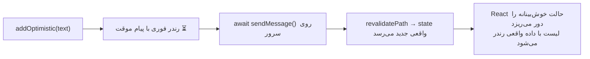
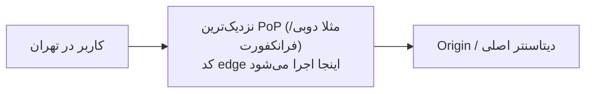
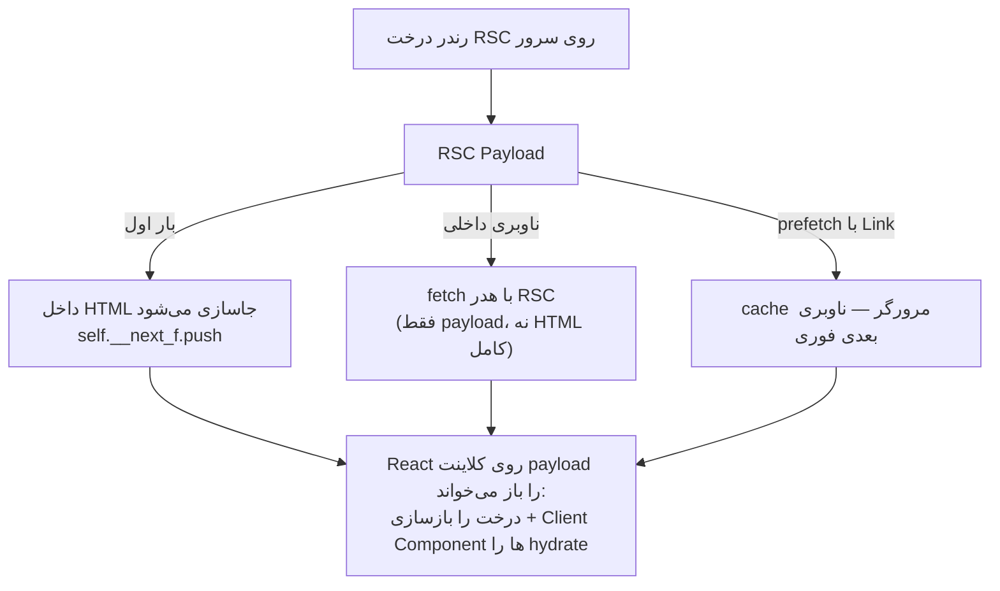
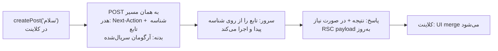

# فصل ۱۳ — عمق‌سنجی: ۹ سوال کلیدی

> 📖 **منابع رسمی:** [react.dev/reference/react](https://react.dev/reference/react) — use، useActionState، useFormStatus، useOptimistic و [nextjs.org/docs](https://nextjs.org/docs) — RSC، Middleware
> 🎯 **هدف:** فصل‌های قبل هر کدام یک قاب کوتاه از این موضوعات را داشتند؛ اینجا ۹ سوال پرتکرار را عمیق و چندسناریویی، همراه با تله‌ها باز می‌کنیم. مکمل فصل‌های **۴، ۶، ۸، ۹ و ۱۱** است.

---

## ۱۳.۱ — هوک `use` با مثال‌های واقعی

### `use` دقیقاً چیست؟

`use` یک API برای «خواندن مقدارِ یک Resource» است. فقط دو نوع Resource می‌فهمد:

1. **Promise** → تا promise حل شود، کامپوننت را **suspend** می‌کند (نزدیک‌ترین `<Suspense>` فعال می‌شود)
2. **Context** → مثل `useContext` مقدار کانتکست را می‌دهد

دو تفاوت بنیادی با بقیه هوک‌ها:

| هوک‌های معمولی (`useState` و…) | `use` |
|---|---|
| فقط در بالاترین سطح کامپوننت | داخل **شرط، حلقه و return های زودهنگام** هم مجاز |
| قانون order-based دارد | مثل یک تابع معمولی است؛ فقط باید داخل کامپوننت/هوک سفارشی صدا زده شود |

### سناریو ۱ — Promise از Server Component (رایج‌ترین الگو در Next.js)

کلید الگو: در سرور promise را **بدون `await`** می‌سازی و به کلاینت می‌فرستی. خودِ promise از مرز سرور→کلاینت قابل انتقال است و کلاینت با `use` منتظرش می‌ماند:

```tsx
// app/dashboard/page.tsx — Server Component
import { Suspense } from "react";
import Profile from "./Profile";
import ActivityFeed from "./ActivityFeed";

export default function Page() {
  const userPromise = getUser(1);      // ⚠️ await نکن — فقط promise را پاس بده
  const activityPromise = getRecentActivity(1);

  return (
    <div>
      <Suspense fallback={<ProfileSkeleton />}>
        <Profile userPromise={userPromise} />
      </Suspense>
      <Suspense fallback={<ActivitySkeleton />}>
        <ActivityFeed activityPromise={activityPromise} />
      </Suspense>
    </div>
  );
}
```

```tsx
// Profile.tsx — Client Component
"use client";
import { use } from "react";
import type { User } from "./types";

export default function Profile({ userPromise }: { userPromise: Promise<User> }) {
  const user = use(userPromise);       // تا حل شدن promise، همین کامپوننت suspend می‌شود
  return <h1 className="text-2xl font-bold">{user.name}</h1>;
}
```

چرا این الگو عالی است؟ دو درخواست **موازی** اجرا می‌شوند و هر کدام که زودتر رسید، همان بخش استریم می‌شود (اتصال به فصل ۹). اگر `await` می‌کردی، کل صفحه تا کندترین query صبر می‌کرد.

### سناریو ۲ — خواندن شرطی Context (مهم‌ترین برتری `use` بر `useContext`)

```tsx
"use client";

function CouponBanner() {
  const { plan } = use(UserContext);      // می‌شود با شرط

  if (plan !== "free") return null;       // کاربران پولی اصلاً به کانتکست تخفیف نیاز ندارند
  const coupon = use(CouponContext);      // ✅ با useContext این خط ارور قواعد هوک می‌گرفت
  return <p>کد تخفیف تو: {coupon.code}</p>;
}
```

### سناریو ۳ — ارور هم خودکار به ErrorBoundary می‌رود

`use(promise)` اگر promise **reject** شود، ارور را به نزدیک‌ترین Error Boundary می‌اندازد — بدون try/catch:

```tsx
<ErrorBoundary fallback={<RetryButton />}>
  <Suspense fallback={<Spinner />}>
    <Profile userPromise={userPromise} />
  </Suspense>
</ErrorBoundary>
```

یعنی «بارگذاری» و «شکست» هر دو به‌صورت declarative مدیریت می‌شوند.

### سناریو ۴ — ⚠️ تله‌ی بزرگ: promise تازه در هر رندر

`use` خودش promise را **cache نمی‌کند**. اگر در هر رندر promise جدید بسازی، هر بار suspend می‌شوی و حلقه‌ی «اسپینر بی‌نهایت» می‌گیری:

```tsx
// ❌ غلط — هر رندر promise جدید → suspend دائمی
function Profile({ id }: { id: number }) {
  const user = use(fetchUser(id));
  return <h1>{user.name}</h1>;
}
```

راه‌های درست، به ترتیب ترجیح:

1. **promise را از والد/سرور بگیر** (سناریو ۱) — بهترین راه
2. در سرور، با `cache()` از react کش کن:

```tsx
import { cache } from "react";
const getUser = cache((id: number) => db.user.findUnique({ where: { id } }));
```

3. در کلاینت، promise را در **state** یا event نگه دار، نه ساخت مستقیم در رندر؛ برای fetch سمت کلاینت به‌هرحال SWR یا TanStack Query ابزار درست‌اند
4. در ماژول (خارج کامپوننت) promise/کش بساز — فقط اگر داده global است

### جدول جمع‌بندی ۱۳.۱

| می‌خواهی… | ابزار درست |
|---|---|
| خواندن داده در Server Component | `await` معمولی |
| دادن داده از سرور به کلاینت با Suspense | promise بساز و پاس بده + `use` در کلاینت |
| خواندن شرطی کانتکست | `use(Context)` |
| fetch سمت کلاینت با کش و refetch | SWR / TanStack Query |
| خواندن یک‌باره در رندر سرور + اشتراک بین چند کامپوننت | `await` + `cache()` |

---

## ۱۳.۲ — `useActionState`: چرخه کامل فرم + Server Action

### امضای هوک

```tsx
const [state, formAction, isPending] = useActionState(action, initialState, permalink?);
```

- **action:** تابعی با امضای متفاوت از action معمولی — آرگومان اول `prevState` است:
  `(prevState, formData) => newState` (همگام یا async)
- **state:** خروجی آخرین اجرای action؛ در اولین رندر `initialState` است
- **formAction:** همان action است که مستقیم به `<form action={...}>` می‌دهی
- **isPending:** از شروع submit تا پایان اجرای اکشن `true`
- **permalink:** (پیشرفته) مسیر جایگزین برای وقتی JS هنوز لود نشده — به‌ندرت لازم می‌شود

### چرا `prevState` وجود دارد؟

چون action ممکن است چند بار اجرا شود (هر submit یک بار). فرم تو باید بداند «اجرای قبلی چه نتیجه‌ای داد» تا مثلاً ارور قبلی را نگه دارد، پیام‌ها را انباشته کند یا شمارنده‌ی تلاش‌ها را بالا ببرد:

```tsx
const [state, formAction, isPending] = useActionState(
  async (prevState, formData) => {
    const email = String(formData.get("email") ?? "");

    if (!email.includes("@")) {
      return { ...prevState, error: "ایمیل نامعتبر است", attempts: prevState.attempts + 1 };
    }
    await addToNewsletter(email);
    return { error: null, success: true, attempts: prevState.attempts + 1 };
  },
  { error: null, success: false, attempts: 0 }
);
```

### مثال کامل Next.js — Server Action + اعتبارسنجی + نتیجه

```tsx
// app/actions.ts
"use server";

export type SignUpState = { error: string | null; ok: boolean };

export async function signUp(prevState: SignUpState, formData: FormData): Promise<SignUpState> {
  const email = String(formData.get("email") ?? "").trim();

  if (!email.includes("@")) {
    return { error: "ایمیل نامعتبر است", ok: false };   // ← به state می‌رود، نه ارور
  }
  if (await emailExists(email)) {
    return { error: "این ایمیل قبلا ثبت شده", ok: false };
  }
  await db.user.create({ data: { email } });
  return { error: null, ok: true };
}
```

```tsx
// app/signup-form.tsx
"use client";

import { useActionState } from "react";
import { signUp } from "./actions";

export default function SignupForm() {
  const [state, formAction, isPending] = useActionState(signUp, { error: null, ok: false });

  return (
    <form action={formAction}>
      <input name="email" type="email" placeholder="ایمیل" />
      <button disabled={isPending}>
        {isPending ? "در حال ثبت…" : "ثبت‌نام"}
      </button>
      {state.error && <p className="text-red-600">{state.error}</p>}
      {state.ok && <p className="text-green-600">ثبت شد! 🎉</p>}
    </form>
  );
}
```

### چهار تله مهم

1. **`throw` به state نمی‌رود** — اگر داخل action ارور پرتاب کنی، به Error Boundary می‌رود و فرمِ کاربر ارور قرمز خودش را نمی‌بیند. برای خطای قابل نمایش به کاربر، **return کن**؛ throw فقط برای باگ‌های واقعی.
2. **`redirect()` را catch نکن** — `redirect` با انداختن یک ارور خاص کار می‌کند؛ اگر دورش try/catch بگذاری، ناوبری خراب می‌شود.
3. **اسم قدیمی:** در Next.js 14 و React 18 این هوک `useFormState` بود؛ در React 19 به `useActionState` تغییر نام داد (و از `react-dom` به `react` منتقل شد).
4. **آرگومان اضافه لازم داری؟** با `bind`:

```tsx
const updateWithId = updateProfile.bind(null, userId);        // userId = آرگومان اول
const [state, formAction] = useActionState(updateWithId, null);
// امضای اکشن: (userId, prevState, formData) => ...
```

> 💡 چون action یک Server Action است، حتی **قبل از لود شدن JS** هم فرم کار می‌کند (progressive enhancement) — مرورگر بدون JS فرم را به‌صورت POST معمولی می‌فرستد و سرور نتیجه را رندر می‌کند.

---

## ۱۳.۳ — `useFormStatus`: وضعیتِ فرمِ پدر، از داخل فرزند

### مسئله‌ای که حل می‌کند

دکمه‌ی submit معمولاً یک کامپوننت مشترک و جداست و به state فرم دسترسی ندارد. راه قدیمی = prop drilling یا Context دستی. راه جدید: فرزند، خودش وضعیت نزدیک‌ترین `<form>` والد را می‌خواند.

```tsx
"use client";

import { useFormStatus } from "react-dom";   // ⚠️ از react-dom است، نه react

export function SubmitButton({ children }: { children: React.ReactNode }) {
  const { pending } = useFormStatus();
  return (
    <button type="submit" disabled={pending}
            className={pending ? "opacity-50 cursor-not-allowed" : ""}>
      {pending ? "⏳ در حال ارسال…" : children}
    </button>
  );
}
```

```tsx
// استفاده — یک دکمه، در هر تعداد فرم:
<form action={signUp}>
  <input name="email" />
  <SubmitButton>ثبت‌نام</SubmitButton>   {/* باید داخل <form> باشد */}
</form>

<form action={deleteAccount}>
  <SubmitButton>حذف حساب</SubmitButton>
</form>
```

### خروجی کامل هوک

```tsx
const { pending, data, method, action } = useFormStatus();
```

| فیلد | معنا |
|---|---|
| `pending` | اکشن فرم در حال اجراست؟ |
| `data` | همان `FormData` در حال submit (مثلاً برای نمایش مقادیر فیلدها هنگام ارسال) |
| `method` | `"get"` یا `"post"` |
| `action` | تابع action که به فرم داده شده |

### تله‌ها

- **باید در درختِ رندر، داخل `<form>` باشد.** اگر هوک را در کامپوننتی صدا بزنی که خودش `<form>` را رندر می‌کند (نه فرزندش)، همیشه `pending: false` می‌بینی — مقصود از «والد»، فرمی است که بالاتر در درخت رندر قرار دارد، نه فرمی که خودِ همان کامپوننت می‌سازد.
- فقط **حین submit** معنا دارد؛ برای نتیجه و ارور (state) ابزار درستی نیست — آن کار `useActionState` است.

### مقایسه سرانگشتی

| نیاز | ابزار |
|---|---|
| دکمه/اسپینر داخل فرم بخواهد pending بداند | `useFormStatus` |
| فرم بخواهد نتیجه/ارور اکشن را نمایش دهد | `useActionState` |
| هر دو | با هم ترکیب می‌شوند بدون هیچ prop ای |

---

## ۱۳.۴ — `useOptimistic`: به‌روزرسانی خوش‌بینانه

### مدل ذهنی

«اول UI را نشان بده که **امیدواریم** بعد از موفقیت این‌طوری شود؛ درخواست واقعی را در پس‌زمینه بفرست؛ وقتی جواب واقعی آمد، React خودش حالت خوش‌بینانه را دور می‌ریزد و با state واقعی جایگزین می‌کند.»

```tsx
const [optimisticState, addOptimistic] = useOptimistic(
  state,               // state واقعی (از props یا useState)
  (current, input) =>  // reducer خوش‌بینانه — باید pure باشد
    nextState(current, input)
);
```

- `optimisticState`: نسخه‌ی موقت برای نمایش
- `addOptimistic(value)`: یک «به‌روزرسانی خوش‌بینانه» ثبت می‌کند؛ **باید داخل یک action یا transition** صدا زده شود

### مثال کامل — چت با Server Action در Next.js

```tsx
// app/actions.ts
"use server";

export async function sendMessage(formData: FormData) {
  const text = String(formData.get("text") ?? "");
  await db.message.create({ data: { text } });
  revalidatePath("/chat");     // ← state واقعی بعد از این به کلاینت می‌رسد
}
```

```tsx
// app/chat/messages.tsx
"use client";

import { useOptimistic, useRef } from "react";
import { sendMessage } from "./actions";

type Msg = { id: string; text: string; sending?: boolean };

export default function Messages({ messages }: { messages: Msg[] }) {
  const [optimisticMsgs, addOptimistic] = useOptimistic(
    messages,
    (current, text: string) => [
      ...current,
      { id: `optimistic-${Date.now()}`, text, sending: true },   // پیام موقت
    ]
  );

  const formRef = useRef<HTMLFormElement>(null);

  async function formAction(formData: FormData) {
    const text = String(formData.get("text") ?? "");
    addOptimistic(text);            // ۱) فوری در UI ظاهر می‌شود (با نشانگر «در حال ارسال»)
    await sendMessage(formData);    // ۲) درخواست واقعی + revalidatePath
    formRef.current?.reset();       // ۳) بعد از پایان، React state خوش‌بینانه را با داده واقعی عوض می‌کند
  }

  return (
    <div>
      {optimisticMsgs.map((m) => (
        <p key={m.id} className={m.sending ? "opacity-50" : ""}>
          {m.text} {m.sending && <span>⏳</span>}
        </p>
      ))}
      <form ref={formRef} action={formAction}>
        <input name="text" />
      </form>
    </div>
  );
}
```

### تایم‌لاین دقیق چه اتفاقی می‌افتد



نکته‌ی مهم: «برگشت» دستی نیست. اگر اکشن شکست بخورد یا revalidate داده‌ی واقعی را بیاورد، چون `optimisticState` از `messages` (prop) مشتق شده، در رندر بعدی به‌طور خودکار به حالت واقعی برمی‌گردد. کار تو فقط یک چیز است: بعد از اکشن، state واقعی را تازه کن (`revalidatePath` در سرور، `router.refresh()` در کلاینت، یا `setState` با نتیجه).

### تله‌ها

- `addOptimistic` را **بیرون از action/transition** صدا نزن — به‌روزرسانی خوش‌بینانه فقط در طول همان action معنا دارد.
- reducer باید **pure** باشد — fetch یا Math.random داخلش ممنوع.
- برای id موقت، چیزی یکتا بساز (`crypto.randomUUID()` بهتر از `Date.now`).
- کاندیدهای خوب برای UX خوش‌بینانه، عملیاتی‌اند که معمولاً موفق می‌شوند (لایک، ارسال پیام، افزودن به لیست). حذف حساب بانکی خوش‌بینانه نیست! 😄

---

## ۱۳.۵ — `forwardRef` چیست و چرا در React 19 حذف شد؟

### قبل از ۱۹: چرا `ref` prop معمولی نبود؟

در React قدیمی، `ref` یک کلید **رزرو شده** بود — مثل `key` — و React هنگام ساختن props آن را جمع و از فهرست حذف می‌کرد؛ یعنی هرگز داخل `props` دیده نمی‌شد. دلیل تاریخی: ref رفتار مخصوصی داشت (attach به DOM یا instance کلاس) و طراحان React خواستند props «آلوده» نشوند.

نتیجه‌ی ناخواسته: **Function Component نمی‌توانست مستقیم ref بگیرد** (در کلاس‌ها ref یعنی instance، اما برای تابع چنین تعریفی وجود نداشت). راه‌حل موقتِ آن دوره:

```tsx
// ❌ روش قدیمی — لازم بود کامپوننت را بپیچی
import { forwardRef } from "react";

const MyInput = forwardRef(function MyInput(props, ref) {   // ref به‌صورت آرگومان دوم!
  return <input {...props} ref={ref} />;
});

// و ترکیب با memo کابوس می‌شد:
const MemoInput = memo(forwardRef(MyInput));
```

### از React 19: `ref` یک prop معمولی است

```tsx
// ✅ روش جدید — بدون wrapper
function MyInput({ ref, ...props }: {
  ref?: React.Ref<HTMLInputElement>;
} & React.ComponentProps<"input">) {
  return <input ref={ref} {...props} />;
}

// استفاده، هر دو یکی است:
<MyInput ref={inputRef} placeholder="نام" />
```

`forwardRef` از ۱۹ **deprecated** است (هنوز کار می‌کند و کد قدیمی را نمی‌شکند) ولی در کد جدید لازم نیست. حتی می‌توانی `props.ref` را مثل هر prop دیگری جابه‌جا کنی، rename کنی یا در spread عبور دهی.

### هدیه‌ی مرتبط در ۱۹ — ref cleanup

تابع‌های callback ref حالا می‌توانند **تابع پاک‌سازی** برگردانند (در نسخه‌های قبلی cleanup وجود نداشت و پاک‌سازی دستی و خطاخیز بود):

```tsx
<input
  ref={(node) => {
    form.register(node);
    return () => form.unregister(node);   // هنگام detach خودکار صدا زده می‌شود
  }}
/>
```

### جدول مهاجرت

| قبل از ۱۹ | از ۱۹ به بعد |
|---|---|
| `forwardRef((props, ref) => …)` | `function C({ ref, ...props })` |
| `memo(forwardRef(C))` | `memo(C)` |
| callback ref بدون cleanup | `ref={() => { …; return cleanup }}` |
| Class Component با `ref` | بدون تغییر — کلاس‌ها همان instance را می‌دهند |

---

## ۱۳.۶ — «Edge» در Middleware یعنی چه؟

کلمه‌ی edge دو معنای مرتبط دارد: یک **زیرساخت** و یک **runtime**.

### ۱) Edge Network — زیرساخت

سرویس‌هایی مثل Vercel/Cloudflare، به‌جای یک دیتاسنتر مرکزی، صدها نقطه‌ی کوچک (PoP) دور دنیا دارند. «Edge» در شبکه یعنی نزدیک‌ترین نقطه به کاربر:



مزیت: middleware قبل از هر request اجرا می‌شود؛ اگر روی دیتاسنتر مرکزی بود، هر کاربر دورافتاده صدها ms تاخیر اضافه می‌برد. روی edge، فاصله فیزیکی حداقل است و **cold start تقریباً صفر** است (process از قبل گرم است).

### ۲) Edge Runtime — ساندباکس اجرا

middleware در Next.js (تا قبل از ۱۶) روی Edge Runtime اجرا می‌شد: یک محیط سبک بر پایه‌ی V8 (همان موتور کروم/ورکرها)، شبیه‌ساز Web Worker — نه Node کامل:

| روی Edge Runtime ✅ | روی Edge Runtime ❌ |
|---|---|
| `fetch`, `Request`, `Response`, `URL` | ماژول‌های Node مثل `fs`, `net`, `child_process` |
| Web Crypto، TextEncoder/Decoder، Streams | پکیج‌های با native binding (مثل `bcrypt`, `prisma`, `sharp`) |
| `next/server` و cookies/headers | localStorage/window طبعاً وجود ندارد (سمت سرور است) |

باینری کوچک است و شروعش سریع — بهایش، محدودیت API است. برای کار middleware (چک کوکی/session، ریدایرکت، rewrite، ست هدر) همین‌قدر کافی است.

### ⚠️ تحول Next.js 16 — چون دوره‌ی ما روی Next 16 است، این را بدان

- نام `middleware.ts` به **`proxy.ts`** تغییر کرده و به‌طور پیش‌فرض روی **Node.js runtime** اجرا می‌شود (دسترسی کامل به API های Node).
- فایل قدیمی `middleware.ts` هنوز پشتیبانی می‌شود و مثل قبل روی edge اجرا می‌شود.
- فلسفه: نام «middleware» خیلی چندمعنایی شده بود و پروژه‌ها گاهی به API های Node نیاز داشتند؛ `proxy` نقش واقعی‌اش (مرز شبکه) را صادقانه می‌گوید.
- از Next.js 15.5 به بعد حتی روی خود `middleware.ts` هم می‌شد `export const config = { runtime: "nodejs" }` گذاشت.

پس جواب مصاحبه‌ای امروزی: **«Middleware کلاسیک Next یعنی کد مرزی که روی Edge Runtime نزدیک کاربر اجرا می‌شد؛ از Next 16 این لایه proxy نام گرفته و روی Node اجرا می‌شود — مفهوم edge حالا بیشتر به زیرساخت CDN/فانکشن‌های لبه مربوط است.»** جزئیات در فصل ۱۱.

---

## ۱۳.۷ — RSC Payload چیست و کجا سفر می‌کند؟

### تعریف

وقتی یک درخت Server Component روی سرور رندر می‌شود، خروجی‌اش **HTML نیست** — یک قالب **سریال‌شده و قابل استریم** از توصیف UI است به نام **RSC Payload** (پروتکل React برای این کار **Flight** نام دارد). در آن:

- متن/ساختار بخش‌های سرور (مثل HTML اما به‌صورت داده‌ای فشرده)
- **ارجاع به chunk های Client Component** (کلاینت باید چه JS ای را دانلود و کجا mount کند)
- **props سریال‌شده** برای هر Client Component
- ارجاع به Server Action ها و promise های در حال استریم

### نمونه‌ی واقعی (ساده‌شده)

اگر سورس صفحه را ببینی، payload را در تکه‌های `self.__next_f.push(...)` می‌بینی:

```js
self.__next_f.push([1, '5:["$","div",null,{"className":"card","children":["$","h1",null,{"children":"سلام دنیا"}]}]'])
```

آن `"$"` ها و اعداد، marker های پروتکل Flight هستند؛ نوع داده، ارجاع (`$L5` یعنی کامپوننت lazy با شناسه ۵) و props را کدگذاری می‌کنند. **JSON خالص نیست** — فرمت مخصوص استریمینگ خودش است.

### سه مسیر سفر payload



به همین دلیل ناوبری در App Router سبک است: **layout های مشترک اصلاً دوباره نمی‌آیند**، فقط payload مسیر جدید.

### «چطوری استفاده میشه؟»

نکته‌ی مهم: **مصرف‌کننده‌ی payload، راوتر Next.js است — تو مستقیم با آن کار نمی‌کنی.** دسترسی‌هایی که به تو می‌دهند:

- `<Link prefetch>` و `router.prefetch` → payload مسیر را از قبل بگیر
- `router.refresh()` → payload تازه‌ی همان مسیر را بگیر و merge کن (بدون از دست رفتن client state)
- `revalidatePath/revalidateTag` در Server Action → بعد از mutation، payload تازه در همان پاسخ برمی‌گردد (فصل ۸)

محدودیت‌های ناشی از آن: props ارسالی به Client Component باید **قابل سریال‌شدن** باشند (فصل ۶) و Server Component ها **هیچ JS ای** به مرورگر نمی‌فرستند.

---

## ۱۳.۸ — Hydration یعنی چه؟

### تعریف یک‌خطی

**هیدریشن = تبدیل HTML استاتیکِ تولیدشده در سرور، به اپ تعاملی React** — React روی کلاینت درخت کامپوننت را در حافظه رندر می‌کند، با DOM موجود **مقایسه** می‌کند و به‌جای ساختن دوباره، به همان گره‌ها **event listener و state** وصل می‌کند.

### تایم‌لاین

```
سرور: HTML کامل را می‌فرستد
  ↓
مرورگر: HTML را paint می‌کند          ← صفحه «دیده می‌شود» ولی «کار نمی‌کند»
  ↓
JS bundle دانلود و اجرا می‌شود
  ↓
React درخت را در حافظه رندر می‌کند
  ↓
با DOM موجود تطبیق می‌دهد (نه از صفر!)   ← Hydration
  ↓
event ها وصل می‌شوند                    ← صفحه تعاملی شد
```

چرا از صفر نمی‌سازد؟ دو دلیل: سریع‌تر است، و وضعیت فعلی DOM (مثل متن تایپ‌شده، فوکوس، اسکرول) از بین نمی‌رود.

### Hydration Mismatch — ارور کلاسیک

اگر خروجی رندر سرور با رندر اول کلاینت فرق کند، React هنگام تطبیق به خطا می‌خورد (در React 19 پیام ارور با diff واقعی DOM نشان داده می‌شود). علت‌های پرتکرار:

```tsx
// ❌ سرور و کلاینت مقدار متفاوتی می‌بینند
function Clock() {
  return <span>{new Date().toLocaleTimeString("fa-IR")}</span>;   // هر لحظه فرق دارد
}
// ❌ Math.random() / تاریخ / locale / Intl پیش‌فرض سیستم
// ❌ خواندن window/localStorage در بدنه‌ی رندر
```

راه‌حل‌ها:

```tsx
// ✅ مقدار وابسته به محیط را بعد از mount بده
function Clock() {
  const [time, setTime] = useState<string | null>(null);
  useEffect(() => {
    const tick = () => setTime(new Date().toLocaleTimeString("fa-IR"));
    tick();
    const t = setInterval(tick, 1000);
    return () => clearInterval(t);
  }, []);
  return <span suppressHydrationWarning>{time ?? "…"}</span>;
}
```

- **`useEffect`**: هر چیزی که فقط سمت کلاینت معنا دارد، بعد از mount
- **`suppressHydrationWarning`**: فقط برای یک المان که تفاوتش اجباری و بی‌خطر است (مثلا ساعت یا افزونه‌ی مرورگر)
- اگر به‌روزرسانی لحظه‌ای در کلاینت لازم نداری، در Server Component رشته‌ی زمان را یک‌بار در سرور بساز و بفرست

### هیدریشن در دنیای RSC — نکته‌ای که مصاحبه دوست دارد

در App Router، «هیدریشن» فقط برای Client Component ها اتفاق می‌افتد. Server Component ها اصلاً JS به مرورگر نمی‌فرستند — چیزی برای هیدریت شدن ندارند و خروجی‌شان همان payload است. یعنی **Selective Hydration**: هرچه Client Component کمتر، هیدریشن سبک‌تر. با Suspense هم هر مرز، وقتی آماده شد مستقل hydrate می‌شود.

---

## ۱۳.۹ — RPC چیست و چه ربطی به Next.js دارد؟

### تعریف عمومی

**RPC (Remote Procedure Call)** = صدا زدن تابعی که روی **ماشین دیگری** اجرا می‌شود، طوری که انگار تابع محلی است. لایه‌ی RPC همه‌ی جزئیات را مخفی می‌کند: آدرس HTTP، متد، سریال‌سازی آرگومان‌ها، پاسخ، خطا.

تفاوت با REST:

| | REST | RPC |
|---|---|---|
| واحد | منبع (Resource): `/posts/12` | عمل/تابع: `deletePost(12)` |
| فعل | GET/POST/PUT/DELETE | صدا زدن متد |
| مناسب | API عمومی، CRUD ساده | عملیات دامنه‌ای، type-safety کامل |

نمونه‌های معروف RPC: **gRPC** (پروتکل‌بافر، بین سرویس‌ها)، **tRPC** (RPC تایپ‌سیف در TypeScript)، **JSON-RPC**.

### ربطش به دوره: Server Action یک RPC است

وقتی می‌نویسی:

```tsx
"use server";                       // app/actions.ts
export async function createPost(title: string) {
  await db.post.create({ data: { title } });
  revalidatePath("/posts");
}
```

```tsx
"use client";                       // هر جا در کلاینت
import { createPost } from "./actions";

<button onClick={() => createPost("سلام")}>…</button>
```

زیر کاپوت این اتفاق می‌افتد:



یعنی کلاینت فقط **reference** تابع را دارد (یک شناسه)؛ بدنه هرگز به مرورگر نرفته است. پروتکل انتقالش هم همان Flight است.

### ⚠️ امنیت — نکته‌ی مصاحبه‌ای

RPC بودن به معنای «فقط اپ خودم صدا می‌زند» **نیست** — هر Server Action یک endpoint عمومی HTTP است. مثل هر API باید: ورودی را سمت سرور اعتبارسنجی کنی، احراز هویت و اجازه را داخل اکشن چک کنی، و هرگز فرض نکنی صدا زننده فقط فرمِ خودت است. (قانون کلی: `use server` یعنی «این تابع URL عمومی دارد».)

### کی Server Action (RPC)، کی Route Handler؟

| سناریو | انتخاب |
|---|---|
| فرم و mutation های UI خودت | Server Action |
| API عمومی برای موبایل/سرویس ثالث | Route Handler |
| Webhook (Stripe و…) | Route Handler |
| دانلود/استریم فایل | Route Handler |
| mutation + به‌روزرسانی فوری UI در یک پاسخ | Server Action + revalidate |

---

## ✅ جمع‌بندی فصل

- `use` = خواندن Promise (با Suspense) و Context (با شرط)؛ تله‌ی اصلی: promise تازه در هر رندر
- سه‌گانه‌ی فرم‌ها: **useActionState** (نتیجه/ارور/isPending) — **useFormStatus** (pending از فرزند فرم) — **useOptimistic** (UX فوری با بازگشت خودکار)
- `ref` در ۱۹ prop معمولی است؛ `forwardRef` فقط راه‌حل موقت گذشته بود + cleanup refs
- Edge = هم زیرساخت (نزدیک‌ترین PoP) هم runtime سبک (نه Node)؛ از Next 16 لایه‌ی middleware به `proxy.ts` روی Node منتقل شده
- RSC Payload = توصیف سریال‌شده‌ی UI (پروتکل Flight)؛ مصرف‌کننده‌اش راوتر Next است؛ ناوبری = جابجایی payload
- Hydration = چسباندن interactivity به HTML سرور؛ mismatch یعنی رندر سرور ≠ کلاینت
- Server Action = RPC روی پروتکل Flight — و هر RPC یک endpoint عمومی است: اعتبارسنجی اجباری

## 📝 تمرین فصل ۱۳

1. چرا در `useActionState` امضای اکشن `(prevState, formData)` است ولی Server Action معمولی فقط `formData` می‌گیرد؟ کدام را مستقیم به `<form action>` می‌دهی؟
2. کد زیر چه باگی دارد و چطور درستش می‌کنی؟

```tsx
function Posts() {
  const posts = use(fetchPosts());   // fetchPosts یک fetch ساده است
  return posts.map(...)
}
```

3. کامپوننت `<DeleteButton />` را داری که `useFormStatus` صدا می‌زند ولی `pending` همیشه false است. دو علت محتمل چیست؟
4. در middleware (یا proxy) چرا نمی‌توانی `bcrypt.compare` صدا بزنی ولی `Web Crypto` را می‌توانی؟ اگر روی الگوی تازه (proxy روی Node) بروی، کجای معماری را عوض می‌کنی؟
5. سناریو: بعد از لاگین می‌خواهی کاربر به `/dashboard` برود ولی خود صفحه دوباره لود نشود و header هم به‌روز شود — کدام مکانیزم‌های این فصل در کارند؟ (نام ببر، مرتب کن)

<details><summary>جواب‌ها</summary>

1. چون useActionState خودش `prevState` را به اکشن تزریق می‌کند تا نتیجه‌ی اجرای قبلی در دسترس باشد؛ Server Action معمولی چنین state ای ندارد و فقط `formData` می‌گیرد. نسخه‌ی سوم (خروجی `useActionState` یعنی `formAction`) به `<form action>` داده می‌شود.
2. promise در هر رندر تازه ساخته می‌شود → suspend بی‌نهایت. درست: promise را در Server Component بساز و به‌عنوان prop بده (و `<Suspense>` بگذار)، یا با `cache()` از react بساز.
3. ① هوک بیرون از `<form>` صدا شده (کامپوننت خودِ form، نه فرزندش)؛ ② دکمه با JS disabled/action معمولی submit می‌شود و pending اصلا فعال نمی‌شود — یا این که فایل از `react` import کرده نه `react-dom`.
4. چون middleware کلاسیک روی Edge Runtime است — ماژول‌های Node/native ندارد؛ Web Crypto استاندارد وب است و در آن ساندباکس هست. درست: هش/کوکی را با Web Crypto (یا کتابخانه سازگار با edge مثل jose) چک کن، یا در Next 16 کار سنگین را به proxy.ts روی Node ببر.
5. ① Server Action لاگین → `redirect("/dashboard")` ② redirect باعث ناوبری RSC می‌شود: فقط RSC Payload مسیر جدید fetch می‌شود (layout مشترک دست نمی‌خورد) ③ در همان پاسخ payload به‌روز، header و دیگر Server Component ها re-render می‌شوند ④ اگر دکمه submit فرم بود، pending با useFormStatus/useActionState.
</details>

➡️ **ادامه:** چیت‌شیت‌های فصل ۱۲ را با این فصل ترکیب کن — این ۹ موضوع دقیقاً سوال‌های پرتکرار مصاحبه‌اند.
